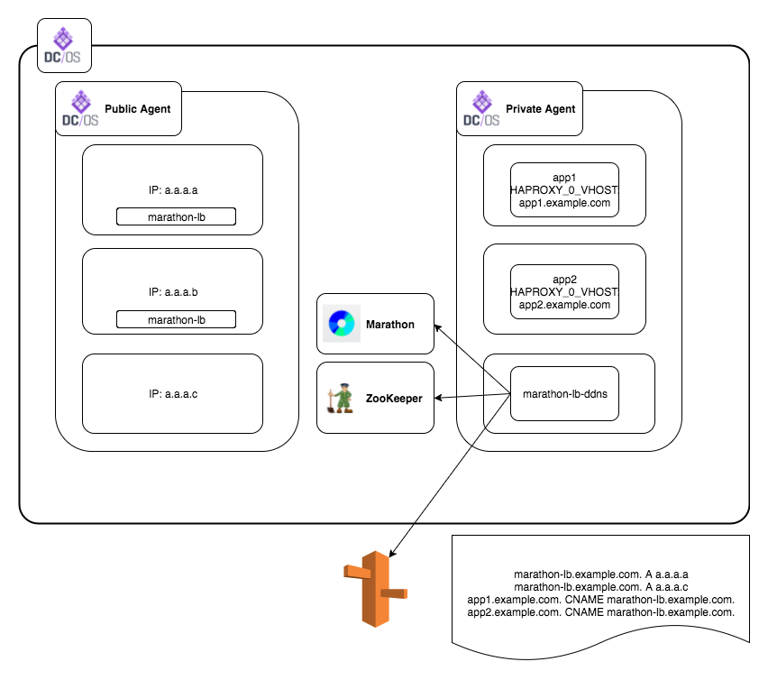

# DDNS(Dynamic DNS) for marathon-lb

Configure DNS Records on Route53 for marathon-lb automatically.

## How it works

This component subscribes events of marathon. When events fired, it retrieves IP addresses of marathon-lb and VHOST names of marathon apps.
The hosts which marathon-lb running on are registered as A record, and marathon apps which has `HAPROXY_{n}_VHOST` label are registered as CNAME record corresponding to  marathon-lb's A Records.

DNS records which was registered by this component are stored in ZooKeeper.
This component delete DNS records only existing in ZooKeeper.  
You should not to run this component concurrently.

## How to use

### Running on marathon (Recommended)
Using marathon-lb.ddns.json.sample as template.

## Options

|name|default|description|
|:-|:-|:-|
|m|`http://mrathon.mesos:8080`|The url of marathon|
|group|`external`|The group of marathon-lb|
|domain|`marathon-lb.example.com`|The A record name of marathon-lb|
|z||The HostedZoneId of Route53|
|lb-id|`/marathon-lb`|The id of marathon-lb|
|zk||The url of zookeeper|
